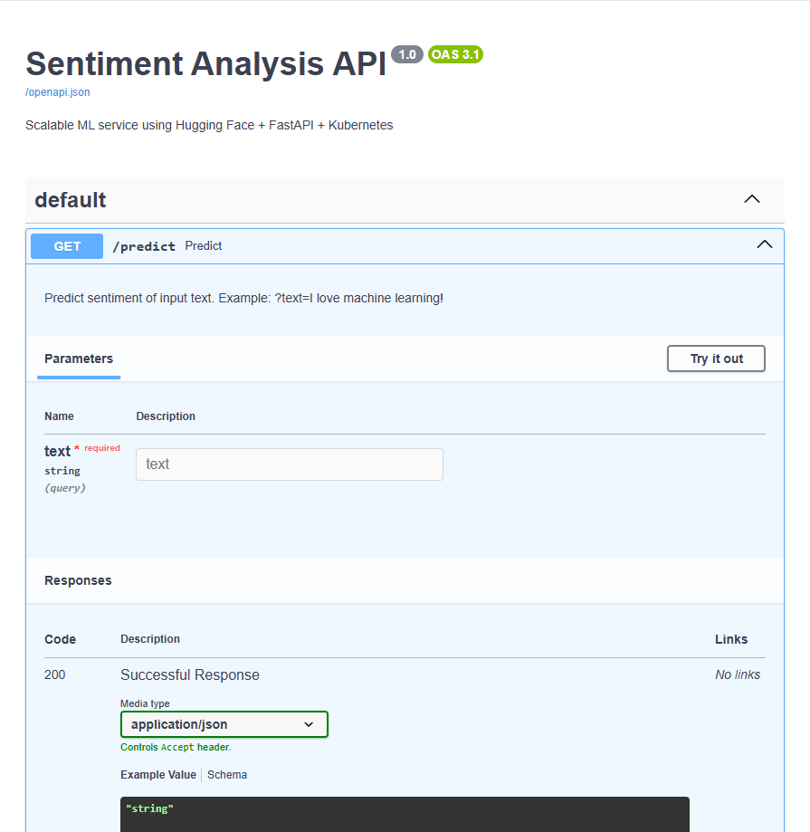
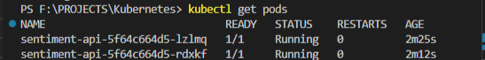

# 🚀 Scalable ML API with Kubernetes

> **Deploy a production-ready sentiment analysis service using open-source tools — all reproducible on your laptop.**  
> This project demonstrates end-to-end MLOps: from Hugging Face model → FastAPI → Docker → Kubernetes.

[](https://kubernetes.io/)
[](https://www.docker.com/)
[](https://fastapi.tiangolo.com/)
[](https://huggingface.co/)

---

## 🎯 Why This Matters

Most ML portfolios stop at Jupyter notebooks.  
This project shows you understand **how models run in production**:

- ✅ **Scalable architecture** (2+ replicas, horizontal scaling)
- ✅ **Health monitoring** (liveness & readiness probes)
- ✅ **Resource safety** (CPU/memory limits)
- ✅ **Zero cloud costs** — runs 100% locally
- ✅ **Open-source stack** (no paid services)

Perfect for **ML Engineer**, **MLOps**, or **Backend ML** roles.

---

## 🧪 Tech Stack

| Component       | Technology |
|-----------------|------------|
| **Model**       | [`cardiffnlp/twitter-roberta-base-sentiment-latest`](https://huggingface.co/cardiffnlp/twitter-roberta-base-sentiment-latest) (Hugging Face) |
| **API**         | FastAPI (auto-generated Swagger docs) |
| **Container**   | Docker |
| **Orchestration**| Kubernetes (via Docker Desktop) |
| **Hardware**    | Runs on any modern laptop (8+ GB RAM) |

---

## ▶️ How to Run Locally

### Prerequisites
- [Docker Desktop](https://www.docker.com/products/docker-desktop/) (with **Kubernetes enabled**)
- Python 3.9+

### Steps
1. **Download the model** (one-time):
   ```bash
   python download_model.py
   ```

2. **Build the Docker image:**
    ```bash
    docker build -t sentiment-api .
    ```

3. **Deploy to Kubernetes:**
    ```bash
    kubectl apply -f k8s/
    ```

4. **Access the API:**
    ```bash
    kubectl port-forward svc/sentiment-api-svc 8080:80
    ```

5. **Test it!**
    - Open interactive docs: http://localhost:8080/docs
    - Predict sentiment:
    ```bash
    curl "http://localhost:8080/predict?text=I%20love%20Kubernetes!"
    ```

## 📈 Scaling in Action

Scale to 5 replicas with one command:
```bash
kubectl scale deployment/sentiment-api --replicas=5
kubectl get pods  # See 5 running pods!
```

## 🖼️ Screenshots

Swagger UI (Auto-generated Docs

Kubernetes Pods (Scaled & Healthy)

## 📁 Project Structure

```
.
├── app/                  # FastAPI application
├── model/                # Hugging Face model (downloaded via script)
├── k8s/                  # Kubernetes manifests
│   ├── deployment.yaml   # Deployment with probes & resources
│   ├── service.yaml      # ClusterIP service
│   └── hpa.yaml          # Example HorizontalPodAutoscaler
├── Dockerfile            # Multi-stage-ready container
├── requirements.txt      # Minimal dependencies
├── download_model.py     # One-click model download
└── README.md
```

## 🚀 What’s Next?

This project is a foundation for:

- CI/CD pipeline (GitHub Actions → build & test on push)
- Monitoring (Prometheus metrics + Grafana)
- Ingress controller (expose via domain)
- Model versioning (MLflow / BentoML)

## 📝 License

MIT — feel free to use, learn, and build upon this project!
